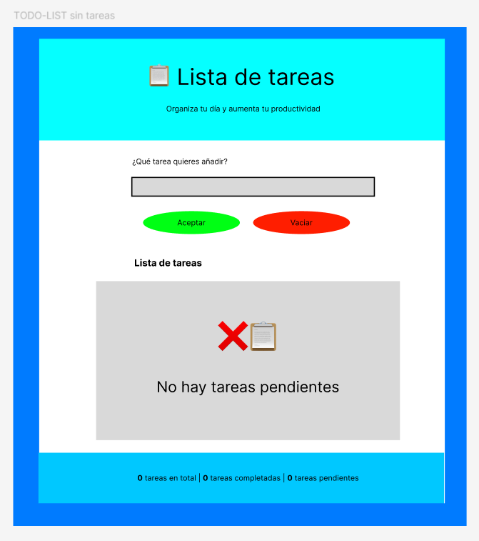
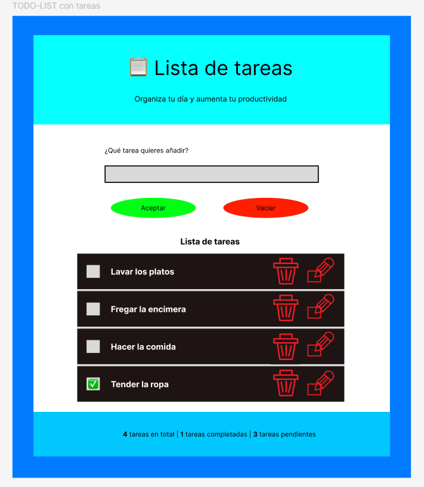
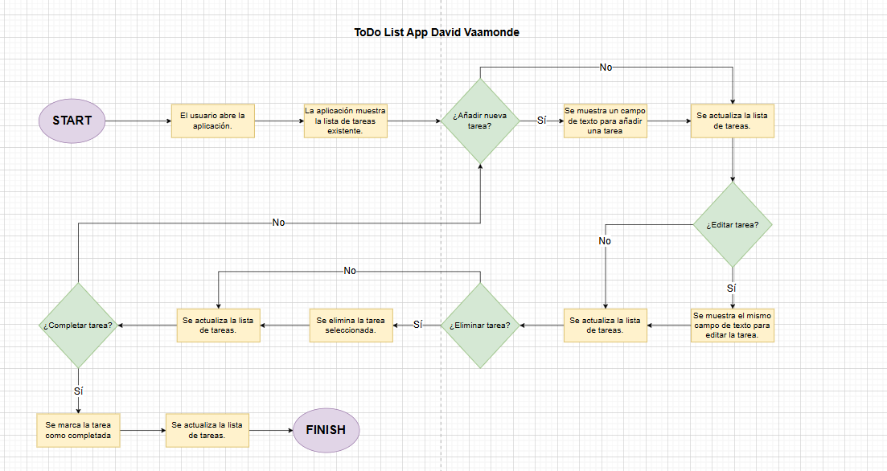

# 📋 TO-DO-List-F5

Esta aplicación tipo to-do list permite gestionar de forma sencilla las tareas: añadir, ver, modificar y eliminar.

<h2>💻 Tecnologías usadas:</h2>

<ul>
  <li>HTML</li>
  <li>CSS</li>
  <li>JavaScript (Vanilla)</li>
  <li>Fetch API</li>
  <li>Json-server (fake API)</li>
  <li>localStorage (como respaldo de los datos)</li>
</ul>

<h2>🛠️ Herramientas</h2>

<ul>
  <li>Visual Studio Code</li>
  <li>Git / Github</li>
  <li>Trello (Planificación de tareas)</li>
  <li>Figma (wireframe y prototipo visual)</li>
</ul>

<h2>📍 Planificación en Trello</h2>

Puedes ver la planificación entera del proyecto en este tablero:

👉 <a href="https://trello.com/b/RCTSzACm">Tablero de Trello</a> 👈 

<h2>🎞️ Wireframe</h2>

Antes de empezar a maquetar, se realizó un wireframe mínimo para planificar la estructura visual de la app.

<h3>Página TO-Do-List sin tareas</h3>

<h3>Página To-Do-List con tareas</h3>

<h2>Diagrama de flujo</h2>

En este diagrama se mostrará la historia del usuario en diferentes etapas:

<h2>Data flow</h2>

